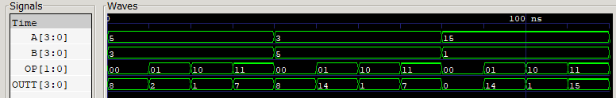
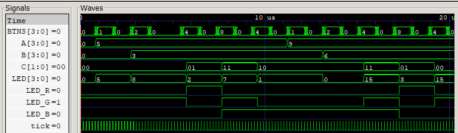
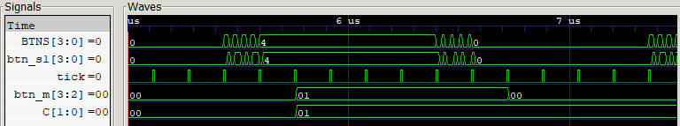

# Laboratorio 02: Diseño, simulación e implementación de una ALU de 4 bits

- **Asignatura:** Electrónica Digital II
- **Semestre:** 2026-2

## Integrantes del equipo

- **Samuel Hincapie Perilla**
- **Eduardo Felipe Camacho Lara**
- **Gabriel Alberto Rodríguez Rincón**

---

## Contenido

1. [Funcionamiento general del sistema](#1-funcionamiento-general-del-sistema)
2. [Arquitectura](#2-arquitectura)
3. [Módulos desarrollados](#3-módulos-desarrollados)
4. [Almacenamiento de operandos](#4-almacenamiento-de-operandos)
5. [Selección y conservación del código de operación](#5-selección-y-conservación-del-código-de-operación)
6. [Indicador de operación en el LED RGB](#6-indicador-de-operación-en-el-led-rgb)
7. [Asignación de pines](#7-asignación-de-pines)
8. [Simulación](#8-simulación)
9. [Implementación y verificación en FPGA](#9-implementación-y-verificación-en-fpga)
10. [Conclusiones](#10-conclusiones)

---

## 1. Funcionamiento general del sistema

El sistema implementa en la Zybo Z7 una ALU de 4 bits cuyos operandos se ingresan por un **bus de datos compartido** (los 4 switches) y se almacenan en registros:

1. Se coloca un valor en los switches y se presiona **BTN0** para guardarlo como **operando A**.
2. Se coloca otro valor y se presiona **BTN1** para guardarlo como **operando B**.
3. Con **BTN2** y **BTN3** se modifica el código de operación. Cada pulsación invierte un bit y el valor se conserva al soltar el botón.
4. La ALU calcula continuamente el resultado a partir de A, B y el código almacenado, y lo muestra en **LD0–LD3**.
5. El **LED RGB** indica con un color la operación seleccionada.

Una vez cargados, los operandos no cambian aunque se muevan los switches, y la operación no cambia aunque se suelten los botones. Solo una nueva carga o una nueva pulsación modifica el estado.

---

## 2. Arquitectura

El diseño separa dos tipos de lógica:

| Tipo | Dónde | Elementos |
|---|---|---|
| **Secuencial** (con reloj) | `datapath.v` | Registros A, B y C, sincronizador de botones, base de tiempo del muestreo |
| **Combinacional** (sin reloj) | `ALU.v` y el decodificador RGB en `datapath.v` | Suma, resta, AND, OR y selección de color |

---

## 3. Módulos desarrollados

### 3.1 `ALU.v`: ALU combinacional

```verilog
always @(*) begin
    case (OP)
        SUM_OP:  OUTT = A + B;
        RES_OP:  OUTT = A - B;
        AND_OP:  OUTT = A & B;
        OR_OP:   OUTT = A | B;
        default: OUTT = 4'b0000;
    endcase
end
```

| Código `OP` | Operación | Ejemplo (A = 5, B = 3) |
|---|---|---|
| `00` | Suma `A + B` | `1000` (8) |
| `01` | Resta `A - B` | `0010` (2) |
| `10` | AND `A & B` | `0001` (1) |
| `11` | OR `A \| B` | `0111` (7) |

- **Puramente combinacional:** usa `always @(*)`, no tiene reloj ni registros, y la salida depende solo de las entradas actuales.
- **Sin latches:** todos los casos del `case` asignan `OUTT` y hay un `default`.
- **Resultado de 4 bits sin acarreo:** la suma y la resta se ven en módulo 16. Por ejemplo, `15 + 1 = 0000` y `3 - 5 = 1110` (−2 en complemento a 2).

### 3.2 `datapath.v`: módulo superior

Es el único módulo conectado a los pines de la FPGA. No contiene operaciones aritméticas ni lógicas; se encarga de:

- Almacenar los operandos A y B.
- Detectar las pulsaciones de BTN2 y BTN3 y almacenar el código de operación C.
- Instanciar la ALU y enviar su resultado a los LEDs.
- Traducir C a un color del LED RGB (sección 6).

```verilog
ALU calll (
    .A    (A),
    .B    (B),
    .OP   (C),
    .OUTT (Z)
);

assign LED = Z;
```

---

## 4. Almacenamiento de operandos

Los operandos se guardan en dos registros de 4 bits que se cargan desde los switches solo mientras el botón correspondiente está presionado:

```verilog
always @(posedge clk) begin
    if (btn_s1[0]) A <= SW;   // BTN0 carga A
    if (btn_s1[1]) B <= SW;   // BTN1 carga B
end
```

- Cuando el botón no está presionado, el registro conserva su valor, sin importar la posición de los switches.
- Mientras el botón está presionado, el registro se recarga en cada ciclo con el mismo valor de los switches, así que el rebote mecánico no afecta el resultado.
- `btn_s1` es la salida de un sincronizador de 2 flip-flops. Los botones son entradas asíncronas al reloj y pasarlas por dos flip-flops evita la metaestabilidad.
- Los registros arrancan en 0 (`reg [3:0] A = 4'd0;`), ya que todos los botones tienen función y no hay uno disponible para reset.

---

## 5. Selección y conservación del código de operación

El código de operación se guarda en el registro `C` de 2 bits. Cada botón invierte uno de sus bits en cada pulsación:

| Botón | Bit que invierte |
|---|---|
| BTN2 | `C[0]` |
| BTN3 | `C[1]` |

Partiendo de `00` (suma), la secuencia BTN2 → BTN3 → BTN2 recorre las cuatro operaciones: `00 → 01 → 11 → 10`.

### 5.1 El problema: reloj rápido y rebote

Hay dos razones por las que no basta con escribir `if (boton) C[0] <= ~C[0];`:

1. **Reloj de 125 MHz:** una pulsación de unos 200 ms dura `0.2 s / 8 ns = 25 000 000` ciclos. El bit se invertiría en cada ciclo mientras el botón está presionado, y el resultado final quedaría al azar.
2. **Rebote mecánico:** al presionar o soltar, el contacto oscila varias veces durante unos milisegundos. Aun detectando flancos, cada oscilación se contaría como una pulsación nueva.

### 5.2 La solución: muestreo cada 10 ms

En lugar de un módulo de antirrebote, BTN2 y BTN3 se **muestrean cada `N_TICK` ciclos**. En cada muestra se compara el valor actual con el anterior y el bit se invierte solo si pasó de 0 a 1:

```verilog
always @(posedge clk) begin
    if (tick) begin
        if (btn_s1[2] & ~btn_m[2]) C[0] <= ~C[0];   // BTN2 -> bit 0
        if (btn_s1[3] & ~btn_m[3]) C[1] <= ~C[1];   // BTN3 -> bit 1
        btn_m <= btn_s1[3:2];                        // guarda la muestra
    end
end
```

```
N_TICK = t_muestreo / T_clk = 10 ms / 8 ns = 1 250 000 ciclos
```

El rebote dura menos de 10 ms, así que entre dos muestras consecutivas solo puede verse **una** transición por pulsación, y el bit se invierte una sola vez. La transición de 1 a 0 (soltar el botón) no produce ningún cambio, por lo que `C` conserva su valor sin necesidad de mantener presionado el botón.

`N_TICK` es un parámetro. En síntesis se usa el valor por defecto (10 ms); en simulación se reduce a 20 ciclos para que la prueba sea corta.

---

## 6. Indicador de operación en el LED RGB

El color depende únicamente del código almacenado en `C`:

| Código | Operación | Color | `LED_R` | `LED_G` | `LED_B` |
|---|---|---|---|---|---|
| `00` | Suma | **Verde** | 0 | 1 | 0 |
| `01` | Resta | **Rojo** | 1 | 0 | 0 |
| `10` | AND | **Azul** | 0 | 0 | 1 |
| `11` | OR | **Cian** (verde + azul) | 0 | 1 | 1 |

Verde y rojo son los colores exigidos por la guía para la suma y la resta. Para AND y OR el grupo eligió **azul** y **cian**.

```verilog
always @(*) begin
    case (C)
        SUM_OP:  {LED_R, LED_G, LED_B} = 3'b010;   // Verde
        RES_OP:  {LED_R, LED_G, LED_B} = 3'b100;   // Rojo
        AND_OP:  {LED_R, LED_G, LED_B} = 3'b001;   // Azul
        OR_OP:   {LED_R, LED_G, LED_B} = 3'b011;   // Cian
        default: {LED_R, LED_G, LED_B} = 3'b000;
    endcase
end
```

---

## 7. Asignación de pines

| Puerto | Pin | Componente |
|---|---|---|
| `clk` | K17 | Reloj de 125 MHz (`create_clock -period 8.00`) |
| `SW[0]` – `SW[3]` | G15, P15, W13, T16 | Switches SW0–SW3 (bus de datos) |
| `BTNS[0]` | K18 | BTN0: cargar A |
| `BTNS[1]` | P16 | BTN1: cargar B |
| `BTNS[2]` | K19 | BTN2: invertir bit 0 del código |
| `BTNS[3]` | Y16 | BTN3: invertir bit 1 del código |
| `LED[0]` – `LED[3]` | M14, M15, G14, D18 | LD0–LD3: resultado |
| `LED_R` | V16 | LED RGB LD6, canal rojo |
| `LED_G` | F17 | LED RGB LD6, canal verde |
| `LED_B` | M17 | LED RGB LD6, canal azul |

---

## 8. Simulación

Las simulaciones se ejecutan con Icarus Verilog y se visualizan en GTKWave, desde la carpeta `sim/`:

```bash
# ALU
iverilog -g2005 -o sim_alu tb_alu.v ../src/ALU.v
vvp sim_alu
gtkwave tb_alu.vcd

# Sistema completo
iverilog -g2005 -o sim_dp tb_datapath.v ../src/datapath.v ../src/ALU.v
vvp sim_dp
gtkwave tb_datapath.vcd
```

Los dos testbenches comparan cada resultado con el valor esperado e imprimen `PASO` o `FALLO`.

### 8.1 Simulación de la ALU (`tb_alu.v`)

El testbench tiene dos partes:

1. **Casos representativos (0–120 ns):** tres pares de operandos fijos mientras `OP` recorre las cuatro operaciones.
2. **Prueba exhaustiva:** las 4 operaciones con las 256 combinaciones de A y B, comparadas contra un modelo de referencia.

```
A=5 B=3 OP=00 -> OUTT=1000 (8)
A=5 B=3 OP=01 -> OUTT=0010 (2)
A=5 B=3 OP=10 -> OUTT=0001 (1)
A=5 B=3 OP=11 -> OUTT=0111 (7)
A=3 B=5 OP=00 -> OUTT=1000 (8)
A=3 B=5 OP=01 -> OUTT=1110 (14)
A=3 B=5 OP=10 -> OUTT=0001 (1)
A=3 B=5 OP=11 -> OUTT=0111 (7)
A=15 B=1 OP=00 -> OUTT=0000 (0)
A=15 B=1 OP=01 -> OUTT=1110 (14)
A=15 B=1 OP=10 -> OUTT=0001 (1)
A=15 B=1 OP=11 -> OUTT=1111 (15)
--------------------------------------------
ALU: PASO - 1036 casos verificados
--------------------------------------------
```



**Comportamiento observado:**

| A | B | `00` Suma | `01` Resta | `10` AND | `11` OR |
|---|---|---|---|---|---|
| 5 | 3 | 8 | 2 | 1 | 7 |
| 3 | 5 | 8 | 14 (−2) | 1 | 7 |
| 15 | 1 | 0 (desborde) | 14 | 1 | 15 |

- Con A y B fijos, `OUTT` cambia en el mismo instante en que cambia `OP`, sin esperar ningún flanco de reloj. Esto confirma que la ALU es combinacional.
- La resta 3 − 5 da `1110`, que es −2 en complemento a 2 de 4 bits.
- La suma 15 + 1 da `0000`, porque el resultado 16 no cabe en 4 bits y el acarreo se descarta.

### 8.2 Simulación del sistema completo (`tb_datapath.v`)

El testbench usa un reloj de 125 MHz, `N_TICK = 20` y pulsaciones **con rebote simulado** (4 oscilaciones al presionar y 4 al soltar). Verifica A, B, C, LED y RGB en 8 casos:

```
OK     SUMA  5+3      : A=5 B=3 C=00 LED=8 RGB=010
OK     RESTA 5-3      : A=5 B=3 C=01 LED=2 RGB=100
OK     OR    5|3      : A=5 B=3 C=11 LED=7 RGB=011
OK     AND   5&3      : A=5 B=3 C=10 LED=1 RGB=001
OK     AND   9&6      : A=9 B=6 C=10 LED=0 RGB=001
OK     OR    9|6      : A=9 B=6 C=11 LED=15 RGB=011
OK     RESTA 9-6      : A=9 B=6 C=01 LED=3 RGB=100
OK     SUMA  9+6      : A=9 B=6 C=00 LED=15 RGB=010
--------------------------------------------
DATAPATH: PASO
--------------------------------------------
```




| Tramo | Botón (`BTNS`) | Acción | `C` | `LED` | RGB |
|---|---|---|---|---|---|
| 1 | BTN0 (`1`) | Carga A = 5 (B sigue en 0) | 00 | 5 | Verde |
| 2 | BTN1 (`2`) | Carga B = 3 | 00 | 8 | Verde |
| 3 | BTN2 (`4`) | `C: 00 → 01` | 01 | 2 | Rojo |
| 4 | BTN3 (`8`) | `C: 01 → 11` | 11 | 7 | Cian |
| 5 | BTN2 (`4`) | `C: 11 → 10` | 10 | 1 | Azul |
| 6 | BTN0, BTN1 | Carga A = 9 y B = 6 sin cambiar la operación | 10 | 1 → 0 | Azul |
| 7 | BTN2 (`4`) | `C: 10 → 11` | 11 | 15 | Cian |
| 8 | BTN3 (`8`) | `C: 11 → 01` | 01 | 3 | Rojo |
| 9 | BTN2 (`4`) | `C: 01 → 00` | 00 | 15 | Verde |

En la simulación se observa que:

- A y B conservan su valor entre cargas, aunque los switches cambien (antes de la primera operación, SW pasa a 15 sin que A ni B se modifiquen).
- C conserva su valor durante todo el tiempo en que `BTNS` vale 0: la operación no depende de mantener presionado ningún botón.
- En el tramo 6 el resultado se actualiza al cargar operandos nuevos, sin volver a seleccionar la operación.
- El color del RGB cambia exactamente cuando cambia `C`.

**Detalle del rebote:**



`BTNS` presenta 4 rebotes al presionar BTN2 y 4 al soltarlo, y `btn_s1` reproduce la misma forma 2 ciclos después (el sincronizador no filtra el rebote, solo evita la metaestabilidad). Sin embargo, `C` cambia **una sola vez** (`00 → 01`), en el `tick` en que la muestra actual vale 1 y la anterior (`btn_m`) valía 0. Al soltar el botón, `btn_m` vuelve a `00` y `C` conserva su valor. En hardware, el muestreo cada 10 ms cumple la misma función, porque es un intervalo mayor que la duración del rebote.

---

## 9. Implementación y verificación en FPGA

### 9.1 Verificación en hardware

---

## 10. Conclusiones
